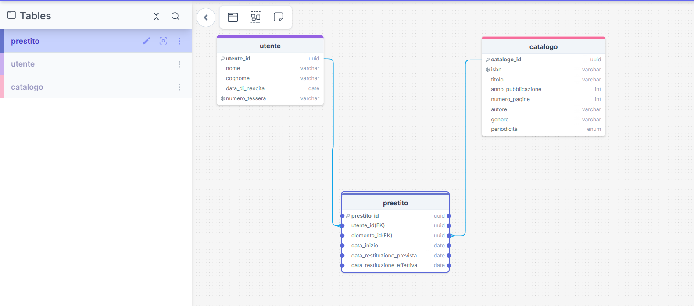

# Spiegazione del progetto

## Diagramma ER

## Diagramma ERD

### Strategia di ereditarietà: SINGLE_TABLE
Ho scelto la strategia SINGLE_TABLE per mappare l'ereditarietà
tra Catalogo, Libro e Rivista perché:
- Le classi figlie hanno differenze minime tra loro
- Libro aggiunge solo: autore, genere
- Rivista aggiunge solo: periodicita
- Le query sul catalogo completo sono più performanti senza JOIN
- Il numero di colonne NULL è ridotto (massimo 3 per riga)

## Relazioni
- Utente → Prestito: One-to-Many — un utente può avere molti prestiti
- Catalogo → Prestito: One-to-Many — un elemento può essere prestato più volte
- Prestito → Utente: Many-to-One — un prestito appartiene a un solo utente
- Prestito → Catalogo: Many-to-One — un prestito riguarda un solo elemento